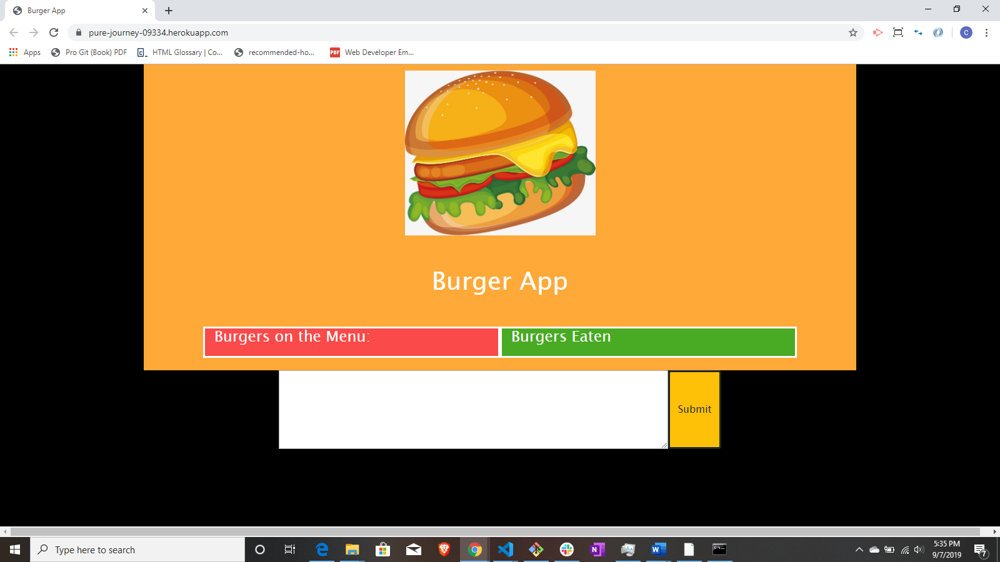
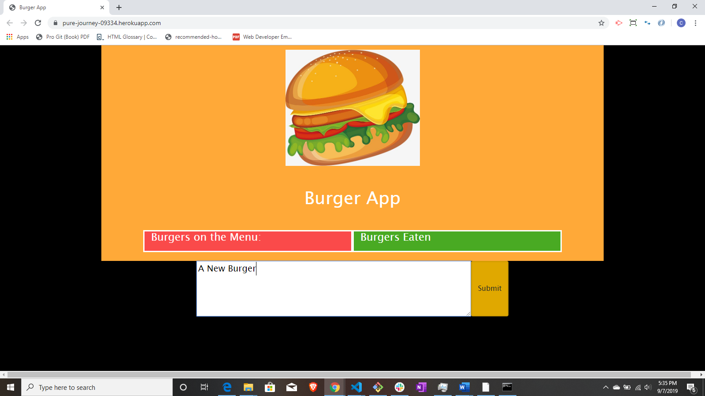
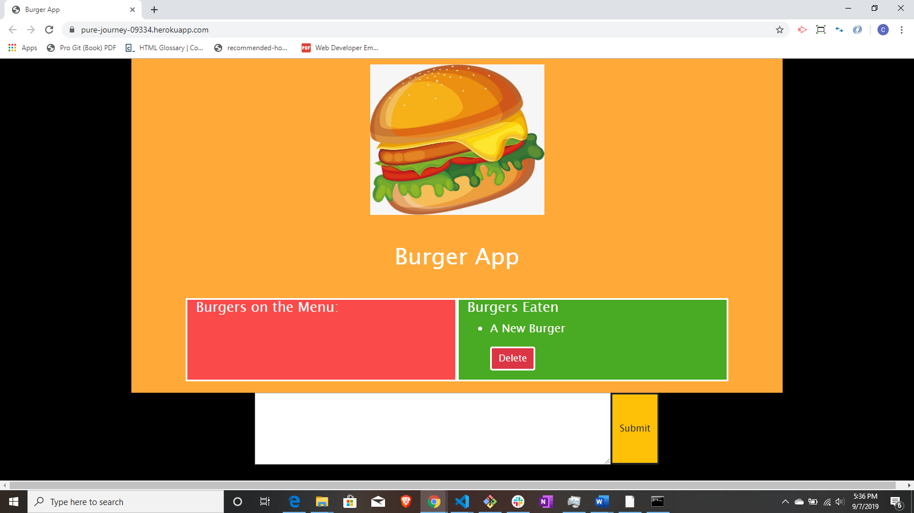

# Burger App #

##### This is a simple CRUD application using the MVC design pattern. It uses Node and MySQL (through a homemade ORM) to route data. The HTML is created using Express-Handlebars. ####

Live Link: https://pure-journey-09334.herokuapp.com/ 

### Step One ###
* Fill in the Input Box with the name of your imaginary burger. This will enter your burger into the database.

### Step Two ###
* You should now see your burger in the "menu" section of the page. Click "Eat" to update the item in the database.

### Step Three ###
* By clicking "Eat", you just changed a boolean value on your burger from false to true. It should now be in the next column.

### Step Four ###
* Should you desire, you can delete your burger from the databse by clikc, you guessed it, "Delete".

